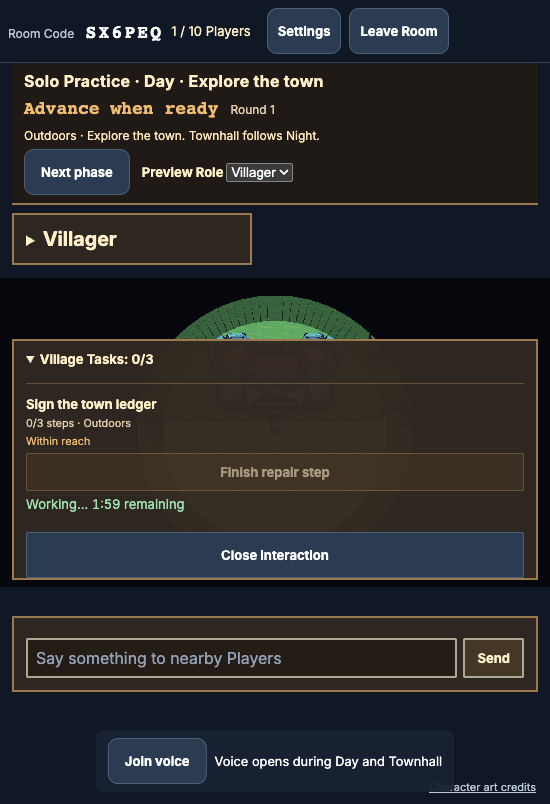
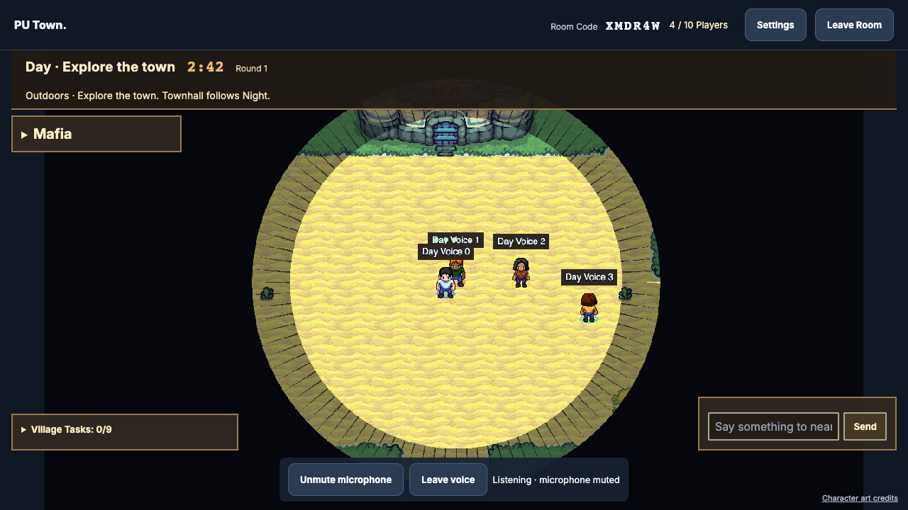

# Browser audit of parent #22 — 2026-10-05

All 24 browser acceptance cases passed across isolated runs. This record maps evidence and limits to every child ticket.

The branch was switched to `live-619e990-tailscale`, fetched and fast-forward pulled at `2d76b78e3eccbeceeb30163ff2a496b77518d48d`. Parent #22 and child issues #23–57 were read individually, including comments. Existing closed ticket status and native verification were not treated as browser evidence.

## Environment and method

macOS arm64, Node 24.21, JDK 17, Playwright’s full Chromium 153 with normal WebGL. Vite 5173, an isolated backend 18081, official LiveKit 1.13.7 built from its pinned source using Go 1.26.3, and synthetic microphone audio. The backend, frontend and SFU were real services. Browser contexts had separate Player identities and session storage. Inputs used visible forms, buttons and keyboard movement; WebSocket assertions inspected only messages delivered to that Player. No hidden Game access or production testing endpoint was added. Audio analysers sampled decoded remote PCM and actual browser output.

A separate hands-on Solo session in the in-app browser completed a repair step, investigated the Practice Mafia as Sheriff, read the private result, confirmed a ballot and read the Mafia Role verdict, then left the Room. The UI improvements were informed by these controls and the multi-Player journeys.

Phases and interactions use real server deadlines. The Task journeys are deliberately long. Concurrent multi-browser suites caused unreliable rendering on this host; full journeys were rerun with limited overlap, and phase waits distinguish delivered network state from resumed frame rendering.

## Browser-discovered fixes

- The Task panel was appended to a nonexistent `#game-container`; it now mounts on the document.
- Countdown ticks replaced focused Task controls. Structural changes now rebuild controls, while countdown and distance updates preserve them.
- Tasks, chat and voice overlapped on smaller displays. Tasks use a collapsible ledger, a focused active interaction, cardinal directions and distance hints; chat and voice have clear space.
- A wrapped phone Room bar let the phase banner cover Leave Room. Game surfaces now start below the measured header height.
- At 550×600, the short-height control grid pulled Day chat underneath the fixed Task panel. Day chat now keeps a separate fixed position; the narrow Task ledger uses the space above it and remains scrollable.

## Ticket evidence

| Ticket | Scope | Browser evidence / limits |
| --- | --- | --- |
| [#23](https://github.com/nirmaljb/pu-town/issues/23) | Center the Game and essential controls | Desktop 1280, phone 390 full timed cycle, compact 550 active Task focus, short 550×600 chat separation, and wrapped header/Leave checks passed. |
| [#24](https://github.com/nirmaljb/pu-town/issues/24) | Run timed Day, sleeping Night and Townhall | Real full desktop phase cycle passed; Night sleep and removal of obsolete Roam controls observed. Solo manual cycle passed. |
| [#25](https://github.com/nirmaljb/pu-town/issues/25) | Choose and confirm Townhall ballots | Competitive keyboard preview sent no message until Confirm; locked Skip/target ballots survived chat and refresh. Target Leave cleared the preview. Other recipients kept private ballots hidden; public results passed. |
| [#26](https://github.com/nirmaljb/pu-town/issues/26) | Resolve Townhall elimination and reveal Roles | Two-round five-Player journey passed: Night elimination, public verdict and Role reveal, then Village victory. Separate Forfeit parity ended immediately for Mafia. |
| [#27](https://github.com/nirmaljb/pu-town/issues/27) | Choose and resolve Mafia Night kills | Real Night target revision from Villager to Sheriff passed; killed the final selected target. The two-Mafia majority case remains separately covered by controlled-clock tests. |
| [#28](https://github.com/nirmaljb/pu-town/issues/28) | Protect Night targets as Doctor | Doctor selected self and survived the second Night when targeted by Mafia; private choices and real deadlines passed. |
| [#29](https://github.com/nirmaljb/pu-town/issues/29) | Investigate Night targets as Sheriff | Sheriff choice and private result survived refresh and the Sheriff’s death; all other recipients had no investigation result. |
| [#30](https://github.com/nirmaljb/pu-town/issues/30) | Walk interiors with shared Day Vision | Keyboard navigation reached every Task site, the return delivery site, and all four interiors; accepted area transitions passed. |
| [#31](https://github.com/nirmaljb/pu-town/issues/31) | Send proximity text without a private Mafia channel | Near-only text delivery passed; approaching later and refresh did not reveal inaccessible earlier history. |
| [#32](https://github.com/nirmaljb/pu-town/issues/32) | Receive and complete persistent repair Tasks | All three real repair stages and earned-stage refresh persistence passed; focused button survives timer updates. |
| [#33](https://github.com/nirmaljb/pu-town/issues/33) | Complete sequence Tasks | All four real sequence stages, explicit wrong-step error and recovery of earned progress passed. |
| [#34](https://github.com/nirmaljb/pu-town/issues/34) | Collect and deliver Task items | Real collect/deliver stages and recovery passed, using keyboard navigation to the actual delivery site. |
| [#35](https://github.com/nirmaljb/pu-town/issues/35) | Perform convincing Mafia Fake Tasks | Mafia completed the first stage of each Fake Task type; aggregate Village progress stayed unchanged. Switching back restored the completed real bank. |
| [#36](https://github.com/nirmaljb/pu-town/issues/36) | Win immediately through completed Tasks | All three browser routes passed: immediate Mafia parity after Forfeit, Village victory after the last Mafia verdict, and immediate Task victory during the ninth Day with all nine assignments complete. |
| [#37](https://github.com/nirmaljb/pu-town/issues/37) | Continue Tasks as an invisible Ghost | Killed Sheriff completed a timed repair as Ghost, remained absent from living fields, and retained the earned step after refresh; chat was readable with sending disabled. |
| [#38](https://github.com/nirmaljb/pu-town/issues/38) | Transfer unfinished Tasks after Forfeit | Villager Leave transferred all three unfinished assignment IDs to living Village Players, preserving total 12; Forfeit parity also passed. |
| [#39](https://github.com/nirmaljb/pu-town/issues/39) | Start and explore Solo Practice | Host-alone gate, Guest Leave, Solo entry, movement, manual phases, no competitive Winner and final Leave passed. |
| [#40](https://github.com/nirmaljb/pu-town/issues/40) | Preview Roles and targets in Solo Practice | Hands-on Solo Sheriff investigation and Mafia ballot/Role reveal passed; automated Doctor/Mafia/Sheriff controls and recovery passed. |
| [#41](https://github.com/nirmaljb/pu-town/issues/41) | Practice real and Fake Task interactions | All nine real Task stages and a first Fake stage of each type passed in one 25-minute Solo journey. Role changes preserve separate banks; manually cycled phases never produce a competitive Winner. |
| [#42](https://github.com/nirmaljb/pu-town/issues/42) | Remember volume settings | Independent saved master/category controls, reload, unavailable storage and actual preview output passed. |
| [#43](https://github.com/nirmaljb/pu-town/issues/43) | Remember reduced motion and fullscreen preferences | Saved reduced motion, OS override, actual fullscreen entry/exit and unavailable fullscreen passed. |
| [#44](https://github.com/nirmaljb/pu-town/issues/44) | Play private action and phase sounds | Actual Night transition tone and nonzero output passed during Solo exploration. Category previews, phase/choice/Task journeys exercise audio; exact private cue selection is additionally covered by deterministic tests. |
| [#45](https://github.com/nirmaljb/pu-town/issues/45) | Hear nearby footsteps and building transitions | Actual keyboard movement produced footstep, building entry and exit tones with nonzero browser output. Exact recipient/proximity authorization is additionally covered by deterministic tests. |
| [#46](https://github.com/nirmaljb/pu-town/issues/46) | Join an authorized Townhall voice call | Actual Townhall PCM passed. Night Join disabled, Ghost forbidden publication rejected with 4003, living-publisher elimination revoked media and old token. |
| [#47](https://github.com/nirmaljb/pu-town/issues/47) | Hear Townhall as an eliminated Participant | Night-eliminated Ghost received actual Townhall PCM with receive-only grant; refresh restored listening and forbidden microphone signaling was rejected. |
| [#48](https://github.com/nirmaljb/pu-town/issues/48) | Hear distance-based Day voice | Actual output/source amplitude comparison confirms listener-distance fade; distant Player received no source. Native evidence additionally covers building boundaries and no chaining. |
| [#49](https://github.com/nirmaljb/pu-town/issues/49) | Show authorized speaking indicators | Nearby screenshot visibly shows authorized green speaking dots. Distant media/source absent; deterministic filtering covers hidden and invisible Players. |
| [#50](https://github.com/nirmaljb/pu-town/issues/50) | Select and test the microphone | Real synthetic getUserMedia capture, local input meter, selection/reload and explicit browser denial passed. Physical device hot-swap not tested. |
| [#51](https://github.com/nirmaljb/pu-town/issues/51) | Use open microphone or configurable push-to-talk | Actual remote PCM appears on held V and stops on keyup or chat focus; typing V does not publish. Open mode and mute passed. |
| [#52](https://github.com/nirmaljb/pu-town/issues/52) | Configure microphone noise suppression | Suppression checkbox changes persist through reload with real capture. Physical noise quality is outside synthetic audio evidence. |
| [#53](https://github.com/nirmaljb/pu-town/issues/53) | Lower effects and ambience during voice | Actual effects and ambience previews fell to settled 25% amplitude during speaking intervals; both recovered above 80% after mute, while the listener’s actual PCM remained present during speech. Deterministic bus tests additionally cover received speech. |
| [#54](https://github.com/nirmaljb/pu-town/issues/54) | Keep playing through a voice outage | Hard-stopped only the owned SFU: browser reconnect status appeared, accepted movement/text and unchanged Game continued, then actual PCM recovered. |
| [#55](https://github.com/nirmaljb/pu-town/issues/55) | Revoke stale voice access on recovery and takeover | Day and Ghost refresh rotated media credentials; old credential returned 403. Leave and elimination stopped actual reception. Native takeover evidence supports the separate takeover route. |
| [#56](https://github.com/nirmaljb/pu-town/issues/56) | Tune Tasks toward nine to ten rounds | Four real browser Players finished all mixed Village Tasks in round nine, with immediate victory after 2,759 real seconds (46 minutes). The controlled-clock measurement for four to ten Players remains supporting evidence; human social-game balance is unverified. |
| [#57](https://github.com/nirmaljb/pu-town/issues/57) | Verify the complete Game and finalize documentation | All 24 browser cases passed across isolated runs, including the 46-minute Task victory. Ten independent contexts joined Townhall voice; nine listeners received actual PCM, then Leave stopped every reception and the old speaker credential returned 403. Remote ICE/TURN was not exercised. |

## Reproduction

From `frontend/`, install Playwright Chromium and follow the README browser setup. Run `npm run test:browser -- --list` to enumerate the acceptance cases. Media cases require the matching private voice environment and a running SFU. For reused services, explicitly set `PU_TOWN_E2E_REUSE=1`; otherwise the harness starts Game/Vite itself and refuses occupied ports.

Useful focused groups:

- `npm run test:browser -- task-usability.spec.ts practice.spec.ts settings.spec.ts`
- `npm run test:browser -- navigation.spec.ts tasks.spec.ts`
- `npm run test:browser -- game-layout.spec.ts townhall-ballots.spec.ts night-and-ghost.spec.ts`
- `npm run test:browser -- microphone.spec.ts microphone-denial.spec.ts voice-controls.spec.ts day-voice.spec.ts townhall-voice.spec.ts voice-capacity.spec.ts`
- `npm run test:browser -- task-victory.spec.ts`

Run the multiplayer groups sequentially on this host. Voice traces can contain private media credentials; do not publish them. The screenshots in this record show UI evidence without credentials.

## Timed workload result

`task-victory.spec.ts` passed in 46 minutes: four independent browsers, three Village Players completing all repair/sequence/collect-deliver stages, using accepted keyboard movement and real server timers. Aggregate completed assignments progressed from 0 to 3 after round three, to 6 after round seven, and to 9 during round nine. The final accepted delivery produced `winner:village` in the same Day, not at a later round boundary. Exact elapsed time from entry was 2,759 seconds. Mafia choices and ballots were deliberately omitted in this workload scenario; the separate two-round journey exercised those competitive actions. This is automated cooperation, not human balance evidence.

## Final browser runs

All 24 cases passed across focused runs, rather than one uninterrupted invocation. The full real/Fake Solo Task journey took 25.1 minutes; the competitive mixed-Task victory took 46.0 minutes; the two-round Night/Ghost/Forfeit journey took 11.2 minutes. Both desktop and phone full-cycle journeys passed, as did private ballots, actual Townhall Ghost media, Day output fade/recovery/outage, microphone denial/input, push-to-talk, settled ducking, settings/fullscreen, navigation audio and Task focus/short-window geometry.

The first capacity run expired at a 20-second status wait. The installed SDK separately budgets signaling and initial RTC connection, with one signaling retry. The corrected 60-second bound retains RTC/browser-animation diagnostics and all actual PCM/revocation assertions. The exclusive ten-context rerun passed in 6.0 minutes. Final review then added phase/round guards at publication and after reception: the strengthened rerun passed in 4.9 minutes, with all ten Players in the same Townhall round, one speaker and nine actual listeners. The initial ducking probe sampled speech/ramp edges; the final strict output bounds apply to complete previews during settled speaking intervals and normal output after mute.

## Supporting checks

Frontend: 103 tests passed, strict typecheck and production build passed. Backend: 119 tests passed. These deterministic checks support, rather than substitute for, browser results.

## Scope of evidence

Synthetic capture tests verify the browser/media path, not physical microphone quality or human listening comfort. Ten-browser group reception is one speaker and nine listeners; the historical native capacity proof covers ninety directed Day pairs separately. No remote Tailscale/ICE/TURN acceptance or physical-device permission UX is implied by local loopback testing. Automated Task timing does not replace human social-game balance testing across all Player counts. Historical native and waived-browser records remain unchanged.

The optional `PU_TOWN_E2E_MEDIA_OUTAGE=1` Day test requires an operator to stop only the dedicated test SFU at `MEDIA_OUTAGE_READY`, leave Game/Vite running, and restart the same SFU configuration at `MEDIA_OUTAGE_RECOVER`. It never stops services itself.

## Standards

No remaining documented-standard violations or new heuristic findings. Test instrumentation stays at browser audio, UI and recipient transport boundaries. Header sizing is presentation-only and its observer is cleaned up. Credentials and traces remain untracked. Earlier harness/documentation findings were resolved.

## Spec

No remaining concrete implementation finding. Earlier missing output attenuation, ten-browser reception and competitive Task-victory evidence prompted additional browser checks. Final review also caught a capacity phase-assertion gap; explicit same-round Townhall checks resolved it and passed in the final runtime rerun. The Task-victory assertion now observes each Player’s earned progress before waiting for the separate Host’s aggregate outcome, avoiding a cross-socket race. Final evidence and human/remote limits are recorded separately above.

Review totals: Standards zero remaining findings; Spec zero remaining code findings. Acceptance limits remain as stated.
